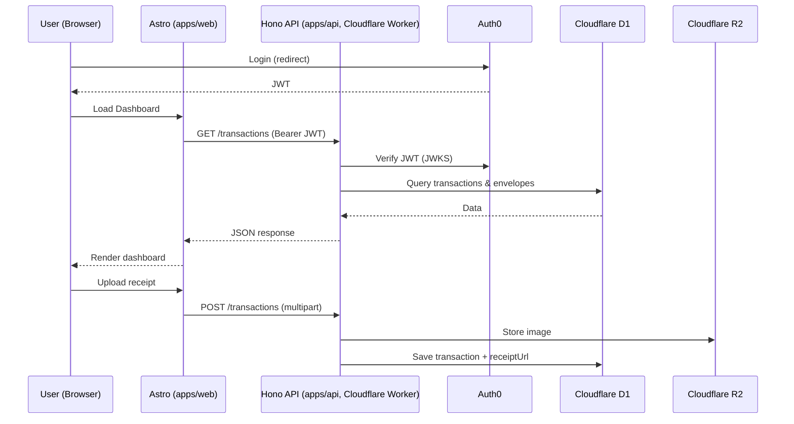

# ARCHITECTURE.md: PocketFlow

Dokumen ini mendefinisikan arsitektur teknis PocketFlow, disesuaikan untuk konteks **solo developer dibantu AI coding agent**. Prinsip utama: minimalkan jumlah moving parts, satu repo, satu target deploy, tetap type-safe end-to-end.

## 1. Ringkasan Perubahan dari PRD.md

PRD.md awalnya mengusulkan Astro (frontend) + NestJS (backend) sebagai dua service terpisah. Untuk solo dev, ini menambah overhead: dua codebase, dua proses deploy, boilerplate NestJS (modules/DI) yang berat untuk tim satu orang, dan AI agent harus menjaga konsistensi kontrak API antar dua repo/proyek.

**Rekomendasi:** Monorepo tunggal di atas **Cloudflare Workers**, dengan:

| Komponen | PRD.md (awal) | Rekomendasi (MVP) | Alasan |
|---|---|---|---|
| Frontend | Astro.js | **Astro.js** (tetap) | Sudah tepat untuk performa + DX |
| Backend framework | NestJS | **Hono** (di atas Cloudflare Workers) | Ringan, native untuk Workers, TypeScript-first, dramatis mengurangi boilerplate dibanding NestJS, tetap terstruktur (routing, middleware) |
| Repo | Tersirat terpisah | **Monorepo** (pnpm workspaces) | Satu tempat untuk AI agent bekerja, share types antara frontend-backend |
| Database | Cloudflare D1 | **Cloudflare D1** (tetap) | Cocok untuk skala awal, terintegrasi native dengan Workers |
| ORM | Prisma (tersirat) | **Drizzle ORM** | Lebih ringan & lebih kompatibel dengan D1/edge runtime dibanding Prisma (Prisma butuh adapter khusus untuk D1 dan lebih berat di edge) |
| Storage | Cloudflare R2 | **Cloudflare R2** (tetap) | Tidak ada alasan berubah |
| Auth | Auth0 | **Auth0** (tetap, sesuai keputusan) | Sesuai preferensi eksplisit |
| Hosting | Cloudflare Pages & Workers | **Cloudflare Workers** (Pages disatukan via Workers Assets) | Satu target deploy, satu `wrangler.toml` |

> Catatan: DATABASE.md menyebut skema Prisma. Jika beralih ke Drizzle, skema perlu ditranslasikan (struktur tabel & relasi tetap sama seperti di DATABASE.md — hanya sintaks ORM yang berubah). Ini pekerjaan mekanis yang aman dilakukan AI agent di awal proyek.

Jika di kemudian hari kompleksitas backend tumbuh signifikan (banyak background job, integrasi kompleks), migrasi bertahap dari Hono ke NestJS tetap dimungkinkan karena kontrak REST API tidak berubah.

## 2. Struktur Monorepo

```
pocketflow/
├── apps/
│   ├── web/                 # Astro.js frontend
│   │   ├── src/
│   │   │   ├── pages/
│   │   │   ├── components/
│   │   │   ├── layouts/
│   │   │   └── lib/api-client.ts   # typed client ke API
│   │   └── astro.config.mjs
│   └── api/                 # Hono backend (Cloudflare Worker)
│       ├── src/
│       │   ├── routes/          # users, envelopes, transactions, plaid (fase 2), achievements
│       │   ├── db/
│       │   │   ├── schema.ts    # Drizzle schema
│       │   │   └── client.ts
│       │   ├── middleware/      # auth (JWT verify Auth0), error handler
│       │   ├── services/        # business logic (envelope calc, achievement engine, dsb)
│       │   └── index.ts
│       └── wrangler.toml
├── packages/
│   └── shared/               # types & validation schema (Zod) dipakai bersama web & api
├── package.json
└── pnpm-workspace.yaml
```

## 3. Alur Request (High-Level)



## 4. Prinsip Desain API

- Mengikuti format response yang sudah didefinisikan di API.md (`success`, `data`/`error`, `pagination`) — **tidak berubah**, karena sudah solid.
- Validasi request body dengan **Zod** schema yang disimpan di `packages/shared`, dipakai ulang di frontend untuk validasi form (single source of truth).
- Semua endpoint protected memvalidasi JWT Auth0 via middleware terpusat di `apps/api/src/middleware/auth.ts`.
- Business logic (kalkulasi saldo envelope, evaluasi achievement, financial health score) ditaruh di `services/`, bukan langsung di route handler — supaya mudah di-unit-test oleh AI agent.

## 5. Data Layer

- Skema tabel mengikuti DATABASE.md (User, Account, Category, Envelope, Transaction) — struktur & relasi tidak berubah, hanya ditulis ulang dalam Drizzle schema.
- Migrasi database dikelola dengan `drizzle-kit` (generate + apply migration ke D1 via `wrangler d1 migrations`).
- Field `accessToken` (Plaid) tetap didefinisikan di skema untuk fase 2, namun tidak dipakai/divalidasi di MVP.

## 6. Deployment

- Single repo, single deploy pipeline: `wrangler deploy` untuk API, Astro build ke Cloudflare Pages/Workers Assets untuk frontend — bisa digabung jadi satu `wrangler.toml` dengan multiple environments jika ingin benar-benar satu perintah deploy.
- Environment: `dev` (local, `wrangler dev` + local D1), `staging` (opsional, bisa dilewati di awal), `production`.
- Secrets (Auth0 client secret, dsb) dikelola via `wrangler secret`.

## 7. Observability (MVP-level)

- Logging dasar via `console.log` terstruktur (JSON) di Worker, dapat dilihat lewat `wrangler tail`.
- Error tracking pihak ketiga (mis. Sentry) — opsional, ditambahkan begitu ada user nyata, bukan prioritas MVP.
- Admin System Health Monitoring (FR-10) ditunda ke fase 3 sesuai REQUIREMENTS.md.

## 8. Keamanan

- JWT Auth0 divalidasi di setiap request terproteksi (signature + expiry + audience).
- Semua akses data di layer service selalu di-scope ke `userId` dari token — tidak pernah trust `userId` dari body/query.
- Upload receipt divalidasi tipe file & ukuran di server, bukan hanya di client.
- Rate limiting dasar di endpoint publik (mis. Cloudflare built-in / middleware sederhana) untuk mencegah abuse.

## 9. Kenapa Ini Cocok untuk Solo Dev + AI Agent

- Satu bahasa (TypeScript) di seluruh stack → AI agent tidak perlu context-switch antar paradigma.
- Types di-share lewat `packages/shared` → mengurangi bug mismatch antara frontend & backend, yang biasanya jadi sumber error terbesar saat AI agent mengedit banyak file sekaligus.
- Hono jauh lebih sedikit boilerplate dibanding NestJS (tanpa decorator/DI container) → lebih mudah di-generate & di-review oleh AI agent per fitur.
- Semua berjalan di Cloudflare Workers → satu mental model deployment, tidak perlu mengelola dua environment berbeda.
