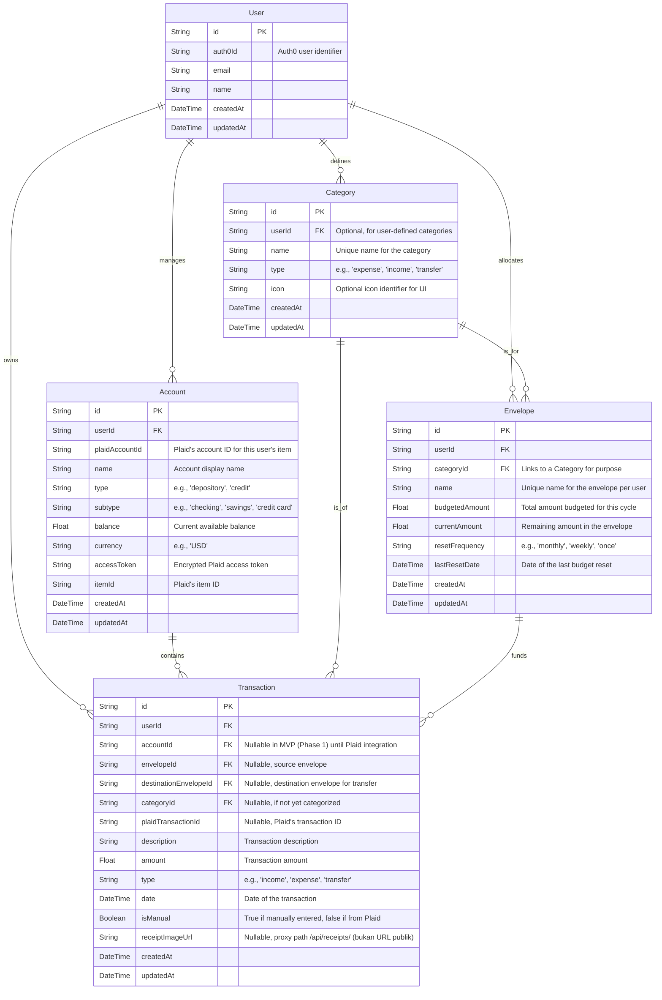

# DATABASE.md: PocketFlow

## 1. Entity Relationship Diagram (ERD)

The following ERD illustrates the core entities within the PocketFlow application and their relationships. It focuses on the primary business logic related to user management, financial accounts, transactions, and the envelope budgeting system.



## 2. Table Definitions

This section details the schema for the 5 core business tables.

### User

Represents a user of the PocketFlow application.

| Column Name | Type | Constraints | Description |
|:---|:---|:---|:---|
| `id` | String | PK | Unique identifier for the user. |
| `auth0Id` | String | UK | Unique identifier from Auth0. |
| `email` | String | UK | User's email address. |
| `name` | String | | User's display name. |
| `createdAt` | DateTime | Default: NOW | Timestamp when the user record was created. |
| `updatedAt` | DateTime | Default: NOW, On Update: NOW | Timestamp of the last update to the user record. |

### Account

Stores information about financial accounts linked by the user via Plaid.

| Column Name | Type | Constraints | Description |
|:---|:---|:---|:---|
| `id` | String | PK | Unique identifier for the account. |
| `userId` | String | FK (User.id) | ID of the user who owns this account. |
| `plaidAccountId` | String | UK (per user) | Plaid's unique ID for this specific account within an item. |
| `name` | String | | User-friendly name for the account (e.g., "My Checking"). |
| `type` | String | | Plaid's primary account type (e.g., `depository`, `credit`). |
| `subtype` | String | | Plaid's detailed account subtype (e.g., `checking`, `savings`). |
| `balance` | Float | | Current available balance of the account. |
| `currency` | String | | Currency code (e.g., `USD`). |
| `accessToken` | String | | Encrypted Plaid access token for the associated item. |
| `itemId` | String | | Plaid's unique ID for the financial institution connection (item). |
| `createdAt` | DateTime | Default: NOW | Timestamp when the account record was created. |
| `updatedAt` | DateTime | Default: NOW, On Update: NOW | Timestamp of the last update to the account record. |

### Category

Defines categories for transactions and envelopes. Can be system-defined or user-defined.

| Column Name | Type | Constraints | Description |
|:---|:---|:---|:---|
| `id` | String | PK | Unique identifier for the category. |
| `userId` | String | FK (User.id), Nullable | ID of the user who created this category. Null for system categories. |
| `name` | String | UK (globally) | Unique name for the category (e.g., "Groceries", "Salary"). |
| `type` | String | | Classification of the category (e.g., `expense`, `income`, `transfer`). |
| `icon` | String | Nullable | Identifier for an icon to represent the category in the UI. |
| `createdAt` | DateTime | Default: NOW | Timestamp when the category record was created. |
| `updatedAt` | DateTime | Default: NOW, On Update: NOW | Timestamp of the last update to the category record. |

### Envelope

Implements the core envelope budgeting system, representing a budget for a specific category.

| Column Name | Type | Constraints | Description |
|:---|:---|:---|:---|
| `id` | String | PK | Unique identifier for the envelope. |
| `userId` | String | FK (User.id) | ID of the user who owns this envelope. |
| `categoryId` | String | FK (Category.id) | ID of the category this envelope is for. |
| `name` | String | UK (per user) | Unique name for the envelope within a user's budget. |
| `budgetedAmount` | Float | | The total amount allocated to this envelope for the current cycle. |
| `currentAmount` | Float | | The remaining amount available in this envelope. |
| `resetFrequency` | String | | How often the envelope budget resets (e.g., `monthly`, `weekly`, `once`). |
| `lastResetDate` | DateTime | | The date when the envelope was last reset. |
| `createdAt` | DateTime | Default: NOW | Timestamp when the envelope record was created. |
| `updatedAt` | DateTime | Default: NOW, On Update: NOW | Timestamp of the last update to the envelope record. |

> **Note — `currentAmount` semantics:** `currentAmount` represents the **remaining balance** in the envelope, not the amount already spent. The spent amount is calculated as `budgetedAmount - currentAmount`. A negative `currentAmount` indicates over-spending (funds have exceeded the budgeted amount).

### Transaction

Records individual financial transactions, whether imported from Plaid or manually entered.

| Column Name | Type | Constraints | Description |
|:---|:---|:---|:---|
| `id` | String | PK | Unique identifier for the transaction. |
| `userId` | String | FK (User.id) | ID of the user who owns this transaction. |
| `accountId` | String | FK (Account.id), Nullable | ID of the account this transaction belongs to. Nullable in MVP (Phase 1) for manual transactions prior to Plaid account linking in Phase 2. |
| `envelopeId` | String | FK (Envelope.id), Nullable | ID of the envelope this transaction was assigned to (source envelope for transfers). |
| `destinationEnvelopeId` | String | FK (Envelope.id), Nullable | ID of the destination envelope for envelope-to-envelope transfer transactions. |
| `categoryId` | String | FK (Category.id), Nullable | ID of the category this transaction belongs to. |
| `plaidTransactionId` | String | UK, Nullable | Plaid's unique ID for the transaction. Null for manual transactions. |
| `description` | String | | Description of the transaction. |
| `amount` | Float | | The transaction amount (positive number). |
| `type` | String | | Type of transaction (`income`, `expense`, `transfer`). |
| `date` | DateTime | | The date the transaction occurred. |
| `isManual` | Boolean | | True if the transaction was manually entered, false if imported from Plaid. |
| `receiptImageUrl` | String | Nullable | Menyimpan path proxy authenticated `/api/receipts/<key>`, di mana `<key>` adalah object key receipt di Cloudflare R2 berbentuk `<userId>/<uuid>.<ext>` — bukan URL publik/signed. Gambar hanya dapat diakses lewat `GET /api/receipts/:key`; penghapusan transaksi terkait membersihkan objek R2-nya. |
| `createdAt` | DateTime | Default: NOW | Timestamp when the transaction record was created. |
| `updatedAt` | DateTime | Default: NOW, On Update: NOW | Timestamp of the last update to the transaction record. |

## 3. Prisma Schema

```prisma
// This is your Prisma schema file,
// learn more about it in the docs: https://pris.ly/d/prisma-schema

generator client {
  provider = "prisma-client-js"
}

datasource db {
  provider = "sqlite" // Cloudflare D1 uses SQLite syntax
  url      = env("DATABASE_URL")
}

model User {
  id        String     @id @default(cuid())
  auth0Id   String     @unique @map("auth0_id")
  email     String     @unique
  name      String
  createdAt DateTime   @default(now()) @map("created_at")
  updatedAt DateTime   @updatedAt @map("updated_at")

  accounts    Account[]
  categories  Category[]
  envelopes   Envelope[]
  transactions Transaction[]

  @@map("users")
}

model Account {
  id             String     @id @default(cuid())
  userId         String     @map("user_id")
  plaidAccountId String     @map("plaid_account_id") // Unique per user's item
  name           String
  type           String
  subtype        String
  balance        Float
  currency       String
  accessToken    String     @map("access_token") // Encrypted
  itemId         String     @map("item_id")
  createdAt      DateTime   @default(now()) @map("created_at")
  updatedAt      DateTime   @updatedAt @map("updated_at")

  user        User        @relation(fields: [userId], references: [id])
  transactions Transaction[]

  @@unique([userId, plaidAccountId]) // A user can only have one record for a given Plaid account ID
  @@map("accounts")
}

model Category {
  id        String     @id @default(cuid())
  userId    String?    @map("user_id") // Null for system categories
  name      String     @unique // All categories (system or user-defined) must have unique names
  type      String     // e.g., 'expense', 'income', 'transfer'
  icon      String?
  createdAt DateTime   @default(now()) @map("created_at")
  updatedAt DateTime   @updatedAt @map("updated_at")

  user      User?      @relation(fields: [userId], references: [id])
  envelopes Envelope[]
  transactions Transaction[]

  @@map("categories")
}

model Envelope {
  id             String     @id @default(cuid())
  userId         String     @map("user_id")
  categoryId     String     @map("category_id")
  name           String
  budgetedAmount Float      @map("budgeted_amount")
  currentAmount  Float      @map("current_amount")
  resetFrequency String     @map("reset_frequency") // e.g., 'monthly', 'weekly', 'once'
  lastResetDate  DateTime   @map("last_reset_date")
  createdAt      DateTime   @default(now()) @map("created_at")
  updatedAt      DateTime   @updatedAt @map("updated_at")

  user     User       @relation(fields: [userId], references: [id])
  category Category   @relation(fields: [categoryId], references: [id])
  transactions Transaction[]

  @@unique([userId, name]) // A user cannot have two envelopes with the same name
  @@map("envelopes")
}

model Transaction {
  id                    String     @id @default(cuid())
  userId                String     @map("user_id")
  accountId             String?    @map("account_id") // Nullable in MVP (Phase 1)
  envelopeId            String?    @map("envelope_id") // Nullable if not assigned / income / source envelope
  destinationEnvelopeId String?    @map("destination_envelope_id") // Destination envelope for transfer
  categoryId            String?    @map("category_id") // Nullable if not yet categorized
  plaidTransactionId    String?    @unique @map("plaid_transaction_id") // Null for manual transactions, unique for Plaid ones
  description           String
  amount                Float
  type                  String     // 'income', 'expense', 'transfer'
  date                  DateTime
  isManual              Boolean    @map("is_manual")
  receiptImageUrl       String?    @map("receipt_image_url") // Authenticated proxy path "/api/receipts/<userId>/<uuid>.<ext>", not a public URL
  createdAt             DateTime   @default(now()) @map("created_at")
  updatedAt             DateTime   @updatedAt @map("updated_at")

  user                User      @relation(fields: [userId], references: [id])
  account             Account?  @relation(fields: [accountId], references: [id])
  envelope            Envelope? @relation(fields: [envelopeId], references: [id])
  destinationEnvelope Envelope? @relation(fields: [destinationEnvelopeId], references: [id])
  category            Category? @relation(fields: [categoryId], references: [id])

  @@map("transactions")
}
```