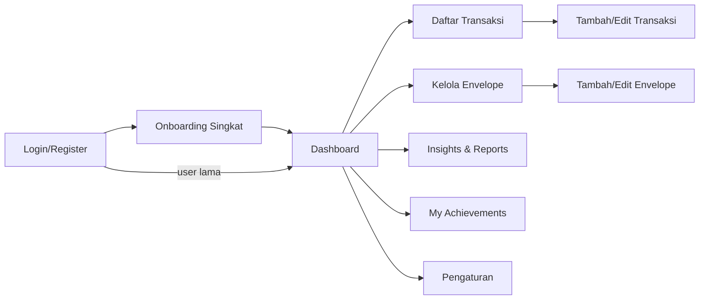
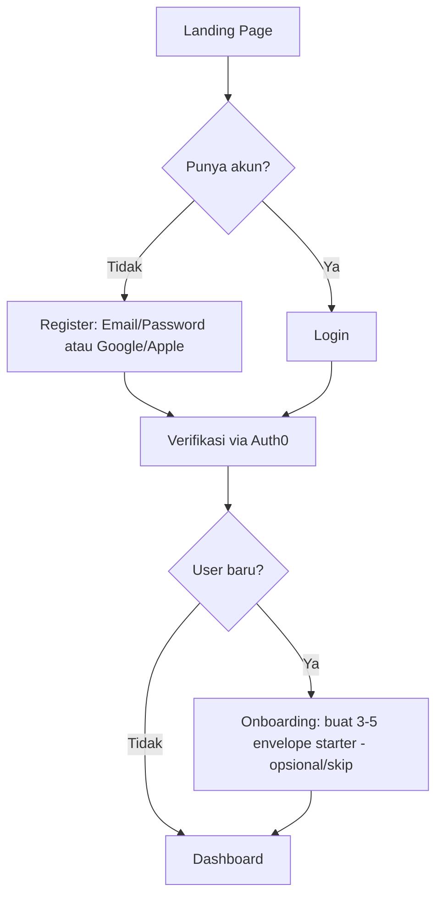
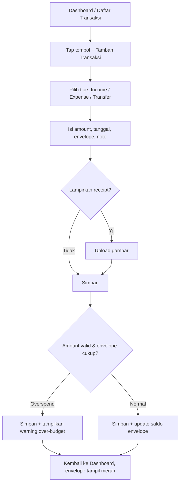
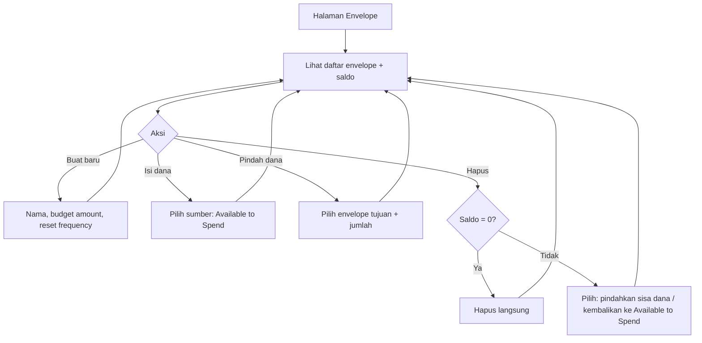
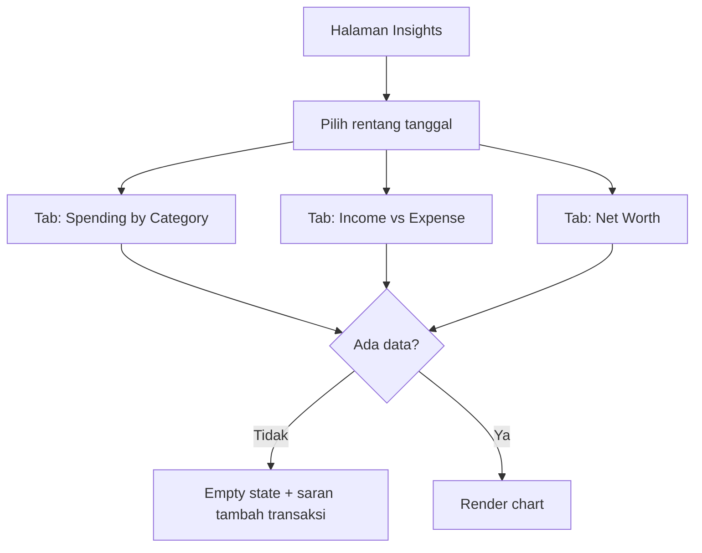
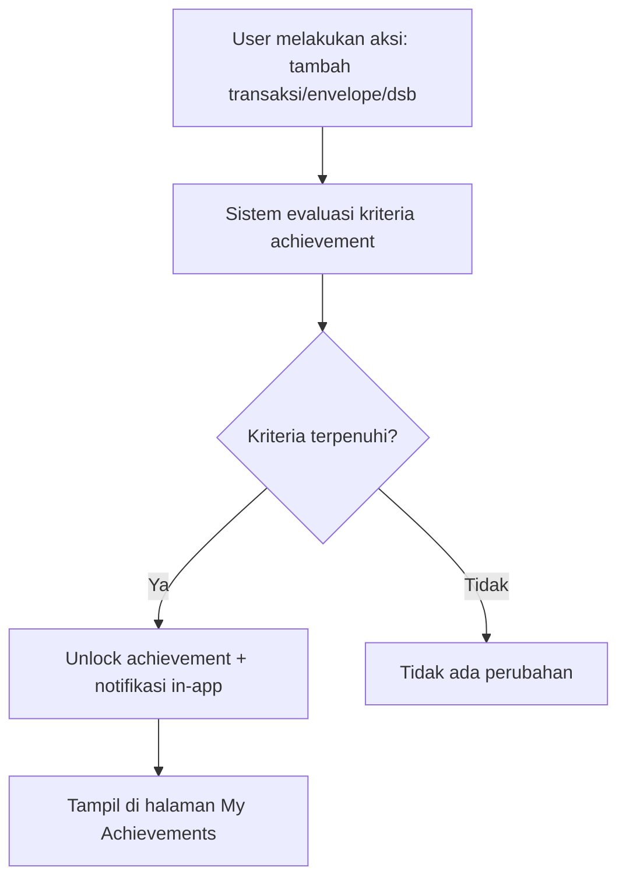

# USER_FLOW.md: PocketFlow

Dokumen ini mendeskripsikan alur pengguna (user flow) untuk fitur-fitur MVP, dilengkapi wireframe kasar (low-fidelity, berbasis teks) karena belum ada desain visual final. Acuan visual detail tetap merujuk ke DESIGN.md (warna, tipografi, spacing).

## 1. Peta Navigasi Utama



Bottom navigation (mobile-first, mengacu spacing 4px grid di DESIGN.md): **Dashboard · Transaksi · Envelope · Insights**. "Achievements" dan "Settings" diakses dari ikon profil/header.

---

## 2. Flow: Onboarding & Registrasi (FR-01)



**Wireframe kasar — Onboarding Envelope Starter:**
```
┌─────────────────────────────┐
│  Selamat datang! 👋          │
│  Mari mulai dengan envelope  │
│  dasar (bisa diubah nanti)   │
│                              │
│  [x] Groceries    Rp 0       │
│  [x] Transport    Rp 0       │
│  [x] Fun          Rp 0       │
│  [ ] + Tambah envelope lain  │
│                              │
│  [ Lewati ]     [ Lanjut ]  │
└─────────────────────────────┘
```

**Edge case yang ditangani UI:** tombol "Lewati" selalu tersedia agar user tidak terjebak di onboarding (sesuai edge case FEATURES.md: user membatalkan proses).

---

## 3. Flow: Tambah Transaksi Manual (FR-02)



**Wireframe kasar — Form Tambah Transaksi:**
```
┌─────────────────────────────┐
│  ← Tambah Transaksi          │
│                              │
│  ( Income )( Expense )(Transfer) │
│                              │
│  Jumlah:      [ Rp _______ ] │
│  Tanggal:     [ 10 Aug 2026 ]│
│  Envelope:    [ Groceries ▾ ]│
│  Catatan:     [___________ ] │
│  Receipt:     [ 📎 Upload  ] │
│                              │
│         [ Simpan Transaksi ] │
└─────────────────────────────┘
```

---

## 4. Flow: Kelola Envelope (FR-03)



**Wireframe kasar — Kartu Envelope (dipakai di Dashboard & halaman Envelope):**
```
┌─────────────────────────────┐
│ 🛒 Groceries                 │
│ ████████░░░░  Rp 380 / 500   │
│ (hijau→kuning saat >70%)     │
└─────────────────────────────┘
```

---

## 5. Flow: Dashboard (FR-04)

**Wireframe kasar:**
```
┌─────────────────────────────┐
│ Available to Spend           │
│        Rp 1.250.000          │
│                              │
│ Financial Health   [ 78/100 ]│
│ ● ● ● ● ○  (ring visual)     │
│                              │
│ Envelope Progress             │
│ [Groceries card] [Fun card]  │
│ [Transport card] [+ Baru]    │
│                              │
│ Transaksi Terbaru             │
│ - Kopi pagi      -Rp 25.000  │
│ - Gaji bulanan  +Rp2.000.000 │
│                              │
│ [Dashboard][Tx][Env][Insight]│
└─────────────────────────────┘
```

**Empty state (user baru, belum ada envelope/transaksi):**
```
┌─────────────────────────────┐
│ Available to Spend Rp 0      │
│                              │
│ Belum ada envelope.          │
│ [ + Buat Envelope Pertama ] │
└─────────────────────────────┘
```

---

## 6. Flow: Insights & Reporting (FR-06)



---

## 7. Flow: Achievements (FR-05)



**Wireframe kasar — Notifikasi Unlock:**
```
┌─────────────────────────────┐
│  🏆 Achievement Terbuka!      │
│  "First Envelope Created"    │
│         [ Lihat Semua ]      │
└─────────────────────────────┘
```

---

## 8. Prinsip UX Lintas Flow

- Sesuai DESIGN.md goal #2: setiap aksi inti (tambah transaksi, isi envelope) harus dapat diselesaikan dalam **≤ 3 tap/klik** dari Dashboard.
- Semua form kritikal (tambah transaksi, buat envelope) memiliki validasi inline (bukan hanya setelah submit).
- Semua state kosong (empty state) harus punya call-to-action yang jelas, tidak boleh layar kosong tanpa arahan.
- Warna status (hijau/kuning/merah) dari DESIGN.md dipakai konsisten di semua tempat yang menampilkan progress envelope (Dashboard, halaman Envelope, notifikasi).
